# 🤖 Cerebra AI - An Intelligent Multi-Modal Assistant


<p align="center">
  
  
  
  
  
</p>

Cerebra AI is a powerful, locally-runnable, full-stack application that functions as an intelligent, multi-modal assistant. It leverages a sophisticated FastAPI backend to intelligently route user requests to a suite of specialized AI tools, including local LLMs via Ollama, image generation via ComfyUI, and various analysis plugins. The frontend is a sleek, responsive chat interface built with React and TypeScript, providing a seamless user experience.

---

## ✨ Features

- **🧠 Intelligent Tool Routing**: A central AI router analyzes user prompts to dynamically select the best tool for the job (e.g., document analysis, image generation, code execution).
- **📄 Document Analysis**: Upload and ask questions about PDF documents. The AI extracts and reasons over the text content.
- **🎨 Image Generation**: Integrates with a running **ComfyUI** instance to generate high-quality images from text prompts.
- **👁️ Vision Analysis**: Upload images and ask questions about their content.
- **🎬 Video & Audio Transcription**: Provides transcription and analysis for video and audio files using OpenAI's Whisper model.
- **💻 Safe Code Execution**: A dedicated plugin allows the AI to write, execute, and debug Python code in a sandboxed environment.
- **💾 Persistent Chat History**: Conversations are automatically saved and can be revisited, managed, and deleted through the UI.
- **🎨 Modern Frontend**: A beautiful and responsive UI built with Tailwind CSS, shadcn/ui, and pixel-retroui, featuring both light and dark themes.

---

## 🏛️ System Architecture

Cerebra AI operates with a decoupled frontend and backend, communicating via a REST API. The backend's AI Router is the core component that delegates tasks to various plugins and external services.

```mermaid
graph TD
    A["Frontend (React + Vite)"] -->|REST API| B(FastAPI Backend);
    B --> C{"🧠 AI Router"};
    C --> D[Plugins & Services];
    subgraph D
        direction LR
        D1[Ollama];
        D2[Whisper];
        D3[ComfyUI];
        D4[Code Runner];
        D5[Vision];
        D6[Doc Analyzer];
    end
```


---

## 🛠️ Tech Stack

### Backend
- **Framework**: FastAPI
- **Database**: SQLAlchemy with SQLite
- **LLM Integration**: Ollama
- **Audio Transcription**: OpenAI Whisper
- **Image Generation**: ComfyUI (via API)
- **Configuration**: Pydantic
- **Core Language**: Python

### Frontend
- **Framework**: React
- **Bundler**: Vite
- **Language**: TypeScript
- **Styling**: Tailwind CSS
- **UI Components**: shadcn/ui, pixel-retroui

---

## 🚀 Getting Started

Follow these instructions to set up and run the Cerebra AI project on your local machine.

### Prerequisites

Ensure you have the following installed on your system:
- **Python** (version 3.10 or higher)
- **Node.js** (version 18 or higher) and **npm**
- **FFmpeg**: Required for video and audio processing. (Install via your system's package manager, e.g., `sudo apt install ffmpeg` or `brew install ffmpeg`).
- **Ollama**: Download and run from the [official Ollama website](https://ollama.com/). Pull a model you wish to use, e.g., `ollama pull llama3`.
- **ComfyUI**: A separate, running instance of ComfyUI is required for image generation. Follow its [installation guide](https://github.com/comfyanonymous/ComfyUI).

### Backend Setup

1.  **Navigate to the Backend Directory:**
    ```bash
    cd /path/to/your/backend
    ```

2.  **Create and Activate a Virtual Environment:**
    ```bash
    python -m venv venv
    source venv/bin/activate  # On Windows, use `venv\Scripts\activate`
    ```

3.  **Install Dependencies:**
    ```bash
    pip install -r requirements.txt
    ```

4.  **Configure Environment Variables:**
    - Create a `.env` file in the backend directory. You can copy the structure from the `requirements.txt` comments if needed.
    - At a minimum, set your `OLLAMA_HOST` and `COMFYUI_URL`.
    ```env
    # .env file
    OLLAMA_HOST="http://localhost:11434"
    LLM_MODEL="llama3" 
    COMFYUI_URL="http://localhost:8188"
    ```

5.  **Run the Backend Server:**
    ```bash
    uvicorn app:app --reload
    ```
    The backend API will be available at `http://127.0.0.1:8000`. You can view the interactive documentation at `http://127.0.0.1:8000/docs`.

### Frontend Setup

1.  **Navigate to the Frontend Directory:**
    ```bash
    cd /path/to/your/frontend
    ```

2.  **Install Dependencies:**
    ```bash
    npm install
    ```

3.  **Run the Frontend Development Server:**
    ```bash
    npm run dev
    ```
    The application will be available at `http://localhost:8080` (or another port if 8080 is in use).

---

## Usage

Once both the backend and frontend servers are running, simply open your web browser and navigate to the frontend URL. You can start a new chat, upload files using the buttons or by dragging-and-dropping, and manage your conversation history through the sidebar.

---

## 📜 License

This project is licensed under the APACHE 2.0 License. See the `LICENSE` file for details.
